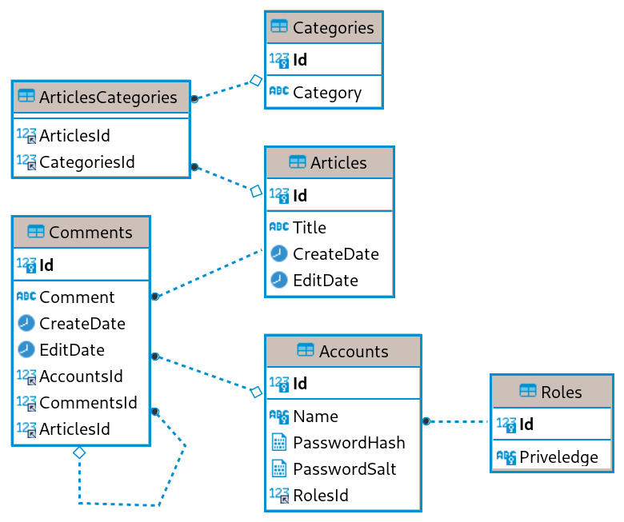
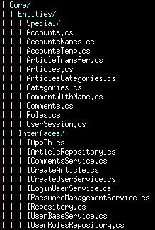

## Introduction
Web application for a server with the purpose of delivering articles to users.

## Conclusion
Backend and frontend written in ASP.NET. The structure follows a Clean architecture and the UI uses a MVC pattern with Razor pages. Backend is done with MariaDB in mind and communicates with the database using the ORM Dapper. Contains custom made authentication and authorization.

## Installation
* Execute the file **sql.sql** file to a database in MariaDB.
* Add the connection string to the file **Startup.cs**.
* **dotnet run** from the UserInterface folder.

## Design
The frontend has functionality to read an article (chosen from a list). Create an account which can later be logged in which makes it possible to comment on a specific article. If the account is an “admin” account it can create new and edit existing articles. A user can update the password for the account, delete comments and delete the account entirely.

The project uses a clean architecture pattern which promotes the programming principle inversion of control (IoC) and provides loose coupling between the layers. This makes the purpose of each layer distinct and writing unit tests for one layer becomes easier because the loose coupling makes it easy to replace dependencies with mocks.

* The **Core** layer contains entities and interfaces that’s used by all the layers and has no dependencies.
* **Infrastructure** contains the repositories which do SQL queries and is only dependent on **Core**.
* **Application** handles most of the business logic and is only dependent on **Core** but also **Infrastructure** to do SQL queries.
* **UserInterface** contains everything that’s shown to the user and is mainly dependent on **Core** and **Application** layers.
* **Application** and **Infrastructure** are implemented as services in the **UserInterface** layer which are then used in different classes by injecting them in the constructor of a class, this is all part of the Dependency Injection pattern.

The user interface project uses ASP.NET with a MVC pattern and Razor pages. The MVC pattern splits the user interface code into three areas called **Model**, **View** and **Controller**.  
A model is what’s being sent and received (GET/POST) by a View. The View is a HTML formatted file with additional Razor syntax. These syntaxes are logic that does logical operations in the HTML document before it’s sent from the server to the client that requested it from a specific endpoint. The Controller handles UI logic (for the View) which uses dependency injected services from the **Application** layer.

Some more design choices that were made early was to not save blobs in the database and do wide queries to the database and sort them in code using LINQ.  
The database software MariaDB (a fork of MySQL) was used because it’s the recommended relation database in many Linux distributions today.
The .NET package Dapper is used because I’m familiar with it and I like the pure SQL queries; not as much abstraction as with for example Entity Framework.

Custom authentication and authorization (even though it’s a part of ASP.NET) was added because I felt it would be fun to learn about.

## Progression
The project started by creating the database first. A basic structure was then added to the “Core” layer with entities and the properties that these entities would need along with interfaces (with needed methods).

> Image of the ER diagram.

> Image of the entities and interface files.

Early work (after database, entities and interfaces) was all about implementing the authentication and authorization. For this the interfaces ICreateUserService, ILoginUserSrvice, IPasswordManagementServices and IUserBaseService have to be implemented.

A user should be able to login and have access to different resources depending on the role the account has been assigned.

In the database this is reflected in the “Accounts” table. The account is saved with a “Name” (used for login), has a role (used to authorization for specific resources) and the password is saved as a hash value with a salt.

The hash and salt part of the password is there to make brute force attacks take a long time before the plain text password is revealed. The hash is the plain text password run through an algorithm to make it unrecognizable. The salt is used to give the hash a unique signature even though the password would be the same as another password/hash to prevent “rainbow table attacks” on the hash.

When a user creates a new account the first thing that happens is that a salt is generated. This is only a cryptographically safe array with bytes. The salt is then used when the hashed password is generated. The hashed password is based on the cleartext password that the user provides in the “create user” form and the salt that’s run through the Argon2 hashing algorithm. Both the hash and the salt is then saved in the database with the account.

During a login the username decides which row in the accounts table is used. The same process is used as when the account is created but the difference is that the salt is never generated this time but instead the salt from the database is used. A session cookie is then generated (which has nothing to do with the actual password/hash, it’s just used for the backend to compare with a list of active sessions) and sent with the HTTP response to the users browser.

Authorization is done for some of the endpoints, this is where the session cookie is used during a request to check if the session is active and check which “role” the session has access to. Certain endpoints like “Admin” and “UserSettings” require these roles.

A user with admin privilege can create or update an article under the “Admin” endpoint. This is simply done by reading/writing a HTML formatted file on disk while some of the data like creation and edit dates are saved in the database (see the “Articles” table). The decision to not save it all in the database was an early design decision of not saving blobs or big files in the database.

A logged in user can create a comment to an article or answer an already existing comment.  
When a user removes the account or a comment any child (replies) should not be removed if there are any but instead the text gets removed and or the account just shows as “DELETED” in the comment.  
When a reply is created the self reference FK from the column **Comments.CommentsId** to **Comments.Id** has a value otherwise it’s null.
JavaScript is used to sort comments, if a parent comment (which has no CommentsId) is present it’s rendered in the “bottom” with child (replies) inside.

## Reflection
I’m satisfied with the result as a whole but I still see many minor areas that could be improved further. Most of the features that were planned from the beginning have been added. The exception is categories (for articles) and the ability to update the text in a comment.

I’ve learned a lot during the course of this project. Most of the patterns and technologies used are things we have used during the course of our education. I’ve got a lot more repetition and got the chance to dive deeper and understand more. Some completely new things include understanding certain flows like with authentication and authorization and generally designing (with a specific architecture in mind) things better than I’ve done in previous projects.

JQuery (a JavaScript library) was new to me but it was not too much work getting into.

Other new things learned outside of the programming was to learn some new syntax for MariaDB (although it’s quite similar to T-SQL) and managing a database on a server from the ground up with creating users and providing certain "grants" to a user.  
Generally learned a lot about security when it comes to storing data securely, cookies and passwords. Outside of the course material I was using a server with Linux environment and got to familiarize myself further with SSH and firewalls.

## Future
* There has to be some spam prevention when creating accounts and comments. CAPTCHA and/or email verification are some of the alternatives.
* For production HTTPS is required or else any of the security measures that have to do with login and authorization cannot be considered to be secured at all.
* Logging needs to be used more extensively in production to catch eventual exceptions or users that try to do non-legitimate things.
* More unit tests should be added and integration testing needs to be done on some scenarios.
* Configuration options (like the SQL connection string) should not be saved in code.
* The missing features (edit comments and categories) need to be added.
* Some columns in the database need to be indexed for performance.
* The styling is very basic as it’s now.